# Whale Town 🐋

**Multi-agent orchestration system for Claude Code with persistent work tracking**

> 🐋 **Fork of [Gas Town](https://github.com/steveyegge/gastown)** by Steve Yegge. Rebranded with whale/ocean theming and terminology.

> *"In the deep waters of Whale Town, the great whales discovered that their bubble nets could trap and carry work across the ocean. The wise Captain learned to harness this power, coordinating Pod Members through the currents, ensuring no task was ever lost to the depths..."*

## Overview

Whale Town is a workspace manager that lets you coordinate multiple Claude Code agents working on different tasks. Instead of losing context when agents restart, Whale Town persists work state in git-backed Blowholes �, enabling reliable multi-agent workflows.

Just like the great whales, our agents create bubbles that rise through the system, carrying important work from the depths to the surface!

### What Problem Does This Solve?

| Challenge                       | Whale Town Solution                             |
| ------------------------------- | ----------------------------------------------- |
| Agents lose context on restart  | Work persists in git-backed Blowholes �        |
| Manual agent coordination       | Built-in mailboxes, identities, and handoffs    |
| 4-10 agents become chaotic      | Scale comfortably to 20-30 agents               |
| Work state lost in agent memory | Work state stored in Bubbles ledger 🫧          |

### Architecture

```mermaid
graph TB
    Captain[The Captain �<br/>AI Coordinator]
    Town[Whale Town Workspace<br/>~/wt/]

    Town --> Captain
    Town --> Pod1[Ocean Lab: Project A 🌊]
    Town --> Pod2[Ocean Lab: Project B 🌊]

    Pod1 --> Crew1[Pod Crew<br/>Your workspace 🧑‍🤝‍🧑]
    Pod1 --> Blowholes1[Blowholes �️<br/>Persistent storage]
    Pod1 --> Members1[Pod Members 🐳<br/>Worker agents]

    Pod2 --> Crew2[Pod Crew]
    Pod2 --> Blowholes2[Blowholes]
    Pod2 --> Members2[Pod Members]

    Blowholes1 -.git worktree.-> GitRepo1[Git Repository]
    Blowholes2 -.git worktree.-> GitRepo2[Git Repository]

    style Captain fill:#4169E1
    style Town fill:#87CEEB
    style Pod1 fill:#20B2AA
    style Pod2 fill:#20B2AA
```



## Core Concepts

### The Captain �

Your primary AI coordinator. The Captain is a Claude Code instance with full context about your workspace, projects, and agents. **Start here** - just tell the Captain what you want to accomplish. Like the lead whale of the pod, the Captain orchestrates all the bubbles!

### Whale Town 🏘️🌊

Your workspace directory (e.g., `~/wt/`). Contains all projects, agents, and configuration.

### Ocean Labs 🧪

Project containers. Each lab wraps a git repository and manages its associated agents. This is where the magic happens in the deep!

### Pod Crew 🧑‍🤝‍🧑

Your personal workspace within a lab. Where you do hands-on work.

### Pod Members 🐳

Ephemeral worker agents that spawn, complete a task, and disappear - like calves learning to hunt before joining the pod!

### Blowholes �️

Git worktree-based persistent storage for agent work. Survives crashes and restarts. Where work surfaces to breathe!

### Bubble Nets 🫧

Work tracking units. Bundle multiple bubbles that get assigned to agents - like the bubble net feeding technique whales use!

### Bubbles Integration 🫧

Git-backed issue tracking system that stores work state as structured data. Like underwater bubbles rising to the surface!

**Bubble IDs** (also called **issue IDs**) use a prefix + 5-character alphanumeric format (e.g., `wt-abc12`, `hq-x7k2m`). The prefix indicates the item's origin or lab. Commands like `wt sling` and `wt convoy` accept these IDs to reference specific work items.

> **New to Whale Town?** See the [Glossary](docs/glossary.md) for a complete guide to terminology and concepts.

## Installation

### Prerequisites

- **Go 1.23+** - [go.dev/dl](https://go.dev/dl/)
- **Git 2.25+** - for worktree support
- **beads (bd) 0.44.0+** - [github.com/steveyegge/beads](https://github.com/steveyegge/beads) (required for bubble support)
- **sqlite3** - for convoy database queries (usually pre-installed on macOS/Linux)
- **tmux 3.0+** - recommended for full experience
- **Claude Code CLI** (default runtime) - [claude.ai/code](https://claude.ai/code)
- **Codex CLI** (optional runtime) - [developers.openai.com/codex/cli](https://developers.openai.com/codex/cli)

### Setup

```bash
# Install Whale Town
go install github.com/speaker20/whaletown/cmd/wt@latest

# Add Go binaries to PATH (add to ~/.zshrc or ~/.bashrc)
export PATH="$PATH:$HOME/go/bin"

# Create workspace with git initialization
wt install ~/wt --git
cd ~/wt

# Add your first project (Ocean Lab)
wt rig add myproject https://github.com/you/repo.git

# Create your Pod Crew workspace
wt crew add yourname --rig myproject
cd myproject/crew/yourname

# Start the Captain session (your main interface)
wt mayor attach
```

## Quick Start Guide

### Getting Started
Run 
```shell
wt install ~/wt --git && 
cd ~/wt && 
wt config agent list && 
wt mayor attach
```
and tell the Captain what you want to build! �

---

### Basic Workflow

```mermaid
sequenceDiagram
    participant You
    participant Captain as Captain �
    participant BubbleNet as Bubble Net 🫧
    participant Member as Pod Member 🐳
    participant Blowhole as Blowhole �️

    You->>Captain: Tell Captain what to build
    Captain->>BubbleNet: Create bubble net with bubbles
    Captain->>Member: Sling bubble to pod member
    Member->>Blowhole: Store work state
    Member->>Member: Complete work
    Member->>BubbleNet: Report completion
    Captain->>You: Summary of progress
```



### Example: Feature Development

```bash
# 1. Start the Captain
wt mayor attach

# 2. In Captain session, create a bubble net with bubble IDs
wt convoy create "Feature X" wt-abc12 wt-def34 --notify --human

# 3. Assign work to a Pod Member
wt sling wt-abc12 myproject

# 4. Track progress
wt convoy list

# 5. Monitor Pod Members
wt agents
```

## Core Principles

### ECHO (Echolocation-based Collaborative Handoff Operations) 🔊

Breaking large goals into detailed instructions for agents. Supported by Bubbles, Epics, Formulas, and Molecules. ECHO ensures work is decomposed into trackable, atomic units that agents can execute autonomously - like whales using echolocation to navigate the deep!

### BLOW (Breathe, Launch, Orchestrate Work) 🌬️

"If there is work on your Blowhole, YOU MUST RUN IT." This principle ensures agents autonomously proceed with available work without waiting for external input. BLOW is the heartbeat of autonomous operation - like a whale that must surface to breathe!

### DIVE (Deeply Integrated Verification Engine) �

The overarching goal ensuring useful outcomes through orchestration of potentially unreliable processes. Persistent Bubbles and oversight agents (Lookout, Sonar) guarantee eventual workflow completion even when individual operations may fail or produce varying results.

## Common Workflows

### Captain Workflow (Recommended)

**Best for:** Coordinating complex, multi-issue work

```mermaid
flowchart LR
    Start([Start Captain �]) --> Tell[Tell Captain<br/>what to build]
    Tell --> Creates[Captain creates<br/>bubble net + members]
    Creates --> Monitor[Monitor progress<br/>via convoy list]
    Monitor --> Done{All done?}
    Done -->|No| Monitor
    Done -->|Yes| Review[Review work 🌊]
```



**Commands:**

```bash
# Attach to Captain
wt mayor attach

# In Captain, create bubble net and let it orchestrate
wt convoy create "Auth System" wt-x7k2m wt-p9n4q --notify

# Track progress
wt convoy list
```

### Minimal Mode (No Tmux)

Run individual runtime instances manually. Whale Town just tracks state.

```bash
wt convoy create "Fix bugs" wt-abc12   # Create bubble net (sling auto-creates if skipped)
wt sling wt-abc12 myproject            # Assign to Pod Member
claude --resume                        # Agent reads mail, runs work (Claude)
# or: codex                            # Start Codex in the workspace
wt convoy list                         # Check progress
```

## Key Commands

### Workspace Management

```bash
wt install <path>           # Initialize workspace (Whale Town HQ)
wt rig add <name> <repo>    # Add Ocean Lab
wt rig list                 # List Ocean Labs
wt crew add <name> --rig <rig>  # Create Pod Crew workspace
```

### Agent Operations

```bash
wt agents                   # List active Pod Members
wt sling <bubble-id> <rig>  # Assign work to member
wt sling <bubble-id> <rig> --agent cursor   # Override runtime for this sling/spawn
wt mayor attach             # Start Captain session
wt mayor start --agent auggie           # Run Captain with a specific agent alias
wt prime                    # Context recovery (run inside existing session)
```

**Built-in agent presets**: `claude`, `gemini`, `codex`, `cursor`, `auggie`, `amp`

### Bubble Net (Work Tracking)

```bash
wt convoy create <name> [issues...]   # Create bubble net with bubbles
wt convoy list              # List all bubble nets
wt convoy show [id]         # Show bubble net details
wt convoy add <convoy-id> <issue-id...>  # Add bubbles to bubble net
```

### Configuration

```bash
# Set custom agent command
wt config agent set claude-glm "claude-glm --model glm-4"
wt config agent set codex-low "codex --thinking low"

# Set default agent
wt config default-agent claude-glm

# View config
wt config show
```

## Dashboard

Whale Town includes a web dashboard for monitoring:

```bash
# Start dashboard
wt dashboard --port 8080

# Open in browser
open http://localhost:8080
```

Features:

- Real-time Pod Member status 🐳
- Bubble Net progress tracking 🫧
- Blowhole state visualization �️
- Configuration management

## Advanced Concepts

### The Propulsion Principle

Whale Town uses git hooks as a propulsion mechanism. Each Blowhole is a git worktree with:

1. **Persistent state** - Work survives agent restarts
2. **Version control** - All changes tracked in git
3. **Rollback capability** - Revert to any previous state
4. **Multi-agent coordination** - Shared through git

### Blowhole Lifecycle


## The Legend of Whale Town 🐋

*Long ago, in the deepest parts of the digital ocean, the great whales discovered something remarkable: their bubble nets could trap not just fish, but ideas, tasks, and entire workflows.*

*The wisest whale became the first Captain, learning to coordinate pods of workers through echolocation - sending messages through the depths that would always reach their destination. They stored work in their Blowholes, ready to surface whenever needed.*

*Today, Whale Town carries on this noble tradition. Like the whales of the deep, we use bubbles to carry our work upward, through the currents, to completion.*

*Remember: In Whale Town, every bubble carries meaning. Every dive has purpose. And the Captain ensures they all reach the surface.* �🫧🌊

## Project Roles

| Role                  | Description            | Primary Interface      |
| --------------------- | ---------------------- | ---------------------- |
| **Captain** �        | AI coordinator         | `wt mayor attach`      |
| **Human (You)** 🧑‍🤝‍🧑  | Pod Crew member        | Your crew directory    |
| **Pod Member** 🐳     | Worker agent           | Spawned by Captain     |
| **Blowhole** �️      | Persistent storage     | Git worktree           |
| **Bubble Net** 🫧     | Work tracker           | `wt convoy` commands   |

## Tips

- **Always start with the Captain** - It's designed to be your primary interface �
- **Use bubble nets for coordination** - They provide visibility across the pod 🫧
- **Leverage blowholes for persistence** - Your work won't sink �️
- **Create formulas for repeated tasks** - Save time with Bubble recipes
- **Monitor the dashboard** - Get real-time visibility
- **Let the Captain orchestrate** - It knows how to lead the pod 🐳

## Troubleshooting

### Pod Members lose connection

Check blowholes are properly initialized:

```bash
wt hooks list
wt hooks repair
```

### Bubble Net stuck

Force refresh:

```bash
wt convoy refresh <convoy-id>
```

### Captain not responding

Restart Captain session:

```bash
wt mayor detach
wt mayor attach
```

## License

MIT License - see LICENSE file for details

---

## Acknowledgments

🐋 **Whale Town** is a themed fork of [**Gas Town**](https://github.com/steveyegge/gastown) by [Steve Yegge](https://github.com/steveyegge).

The original Gas Town project established the foundational architecture for multi-agent orchestration with Claude Code. Whale Town reimagines this powerful system with whale/ocean theming while preserving its robust functionality.

*Made with 🐋 energy from the depths of the digital ocean*
